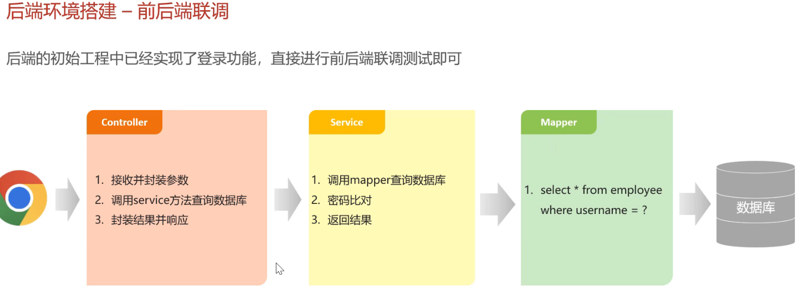
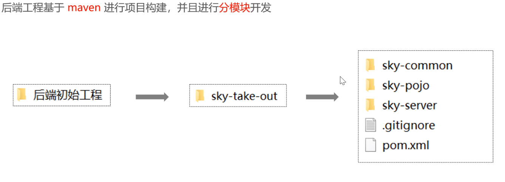
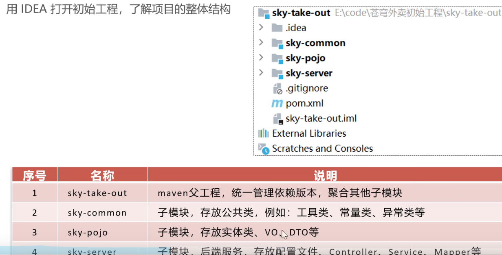
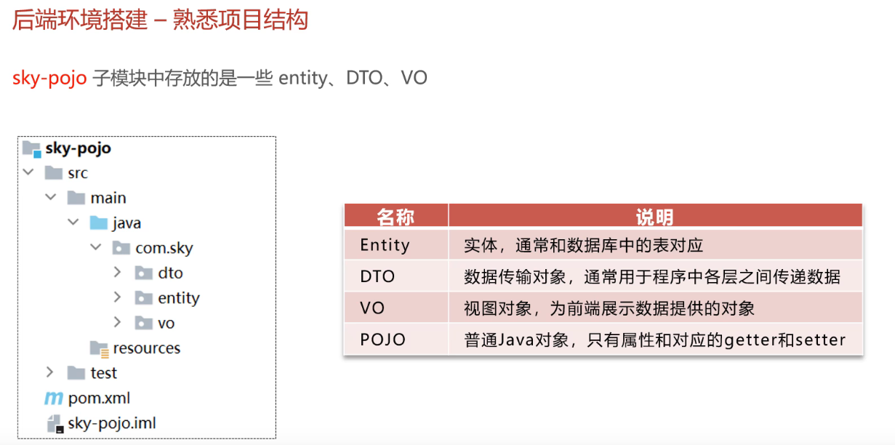
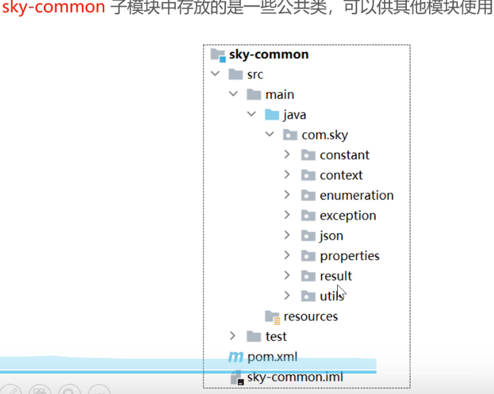

### 1. 实体类 (Entity Class) — *Entity Class*
**一句话总结：它是数据库表在 Java 里的“替身”。**

*One-line summary: It is the Java "stand-in" for a database table.*

在《苍穹外卖》的项目代码里，你会看到一个专门的文件夹（模块）叫 `sky-pojo`。你可以把它理解为**数据的“模具”或“容器”**。

*In the Sky Take-out (`苍穹外卖`) project code, you will see a dedicated folder (module) called `sky-pojo`. You can think of it as a **"mold" or "container" for data**.*

简单来说，**POJO** 的全称是 **Plain Old Java Object**，翻译过来就是“**最普通、最简单的 Java 对象**”。

*Simply put, **POJO** stands for **Plain Old Java Object** — literally "**the most ordinary, simplest Java object**".*

在《苍穹外卖》中，数据库里有一张表叫 `employee`（员工表），里面有 `id`、`username`、`password` 等字段。

*In Sky Take-out, the database has a table called `employee` (the employees table), which contains fields like `id`, `username`, and `password`.*

* **作用：** 用来承载数据。后端从数据库查出一条员工记录后，会把它存进一个 Java 对象里，这个对象的模板就是“实体类”。
* **JS 类比：** 就像你在 JS 里定义一个专门存储数据的对象字面量或简单的 `class User { ... }`。
* **! 在项目里的位置：** 你会看到一个 `sky-pojo` 模块，里面有很多类。
    * **Entity：** 完全对应数据库表。
    * **DTO (Data Transfer Object)：** 前端传给后端的数据（比如登录时的用户名和密码）。
    * **VO (View Object)：** 后端传给前端展示用的数据。
    * **POJO 包括 DTO ，VO (View Object) ， Entity** 

***Key points:***

* ***Purpose:** to carry data. After the backend queries an employee record from the database, it stores that record in a Java object — the template for that object is the "entity class".*
* ***JS analogy:** like defining a plain object literal in JS just to hold data, or a simple `class User { ... }`.*
* ***! Where it lives in the project:** you will see a `sky-pojo` module containing many classes.*
    * ***Entity:** maps one-to-one to a database table.*
    * ***DTO (Data Transfer Object):** data sent from the front end to the back end (e.g., username and password during login).*
    * ***VO (View Object):** data the back end sends to the front end for display.*
    * ***POJO includes DTO, VO (View Object), and Entity.***


---

### 1. 为什么叫“最普通”？ — *Why Is It Called "Plain Old"?*
在早期的 Java 开发中，对象往往需要继承很多复杂的库或遵守极其严格的规范。后来开发者们提倡：为什么不回归简单呢？

*In the early days of Java development, objects often had to extend complex library classes or adhere to extremely strict specifications. Later, developers advocated: why not go back to simplicity?*

* **POJO 不继承**任何特殊的父类。
* **POJO 不实现**任何特殊的接口。
* 它只包含**私有属性**（Fields）和操作这些属性的 **get/set 方法**。

***Key points:***

* ***A POJO does not extend** any special parent class.*
* ***A POJO does not implement** any special interface.*
* *It only contains **private fields** and the **get/set methods** that operate on those fields.*

### 2. POJO 里面细分的“三兄弟” — *The "Three Brothers" Inside a POJO*
在 [Day01-05 熟悉项目结构](https://www.bilibili.com/video/BV1TP411v7v6?p=6) 这一集视频中，你会发现 `sky-pojo` 下面还有三个子文件夹，它们其实都是 POJO，只是**用途不同**：

*In the [Day01-05 Getting Familiar With the Project Structure](https://www.bilibili.com/video/BV1TP411v7v6?p=6) video, you will see that `sky-pojo` has three sub-folders. They are all POJOs — only their **intended use differs**:*

| 名称 / Name | 全称 / Full Name | 形象比喻 / Analogy | 实际用途 / Actual Use |
| :--- | :--- | :--- | :--- |
| **Entity** | 实体类 <br> *Entity class* | **数据库的“复印件”** <br> *The "photocopy" of the database* | 它的属性和数据库里的表字段**一模一样**。 <br> *Its fields match the database table columns **exactly**.* |
| **DTO** | Data Transfer Object | **前端发来的“表单”** <br> *The "form" sent from the front end* | 专门用来接收前端传来的数据（比如登录时的账号密码）。 <br> *Used specifically to receive data sent from the front end (e.g., username and password during login).* |
| **VO** | View Object | **给前端看的“展示页”** <br> *The "display page" for the front end* | 后端处理完后，把需要展示的数据打包发给前端。 <br> *After the backend finishes processing, it packages the data to be displayed and sends it to the front end.* |


---

### 3. 用你熟悉的 Vanilla JS 来类比 — *An Analogy in Vanilla JS You Already Know*
如果你用原生 JS 写一个员工信息，你可能会直接写：

*If you wrote an employee record in vanilla JS, you would probably just write:*

```javascript
const employee = {
    id: 1,
    name: "张三",
    username: "zhangsan123"
};
```
在 Java 里，因为它是**强类型**语言，不能随手写个大括号。你必须先定义一个“模具”（也就是 POJO）：

*In Java — because it is a **strongly typed** language — you cannot just toss out a pair of curly braces. You must first define a "mold" (i.e., a POJO):*

```java
public class Employee {
    private Long id;
    private String name;
    private String username;
    
    // 后面还有一堆 get 和 set 方法...
}
```
当你从数据库查到张三的信息时，Java 就会根据这个 `Employee` 类创建一个对象，把数据填进去。

*When you query Zhang San's information from the database, Java creates an object based on this `Employee` class and fills the data in.*

### 总结 — *Summary*
**POJO 文件夹里放的就是这些“数据模具”。** * 如果你想看**数据库里有哪些字段**，去 `entity` 找。
* 如果你想看**前端登录要传什么参数**，去 `dto` 找。
* 如果你想看**后端最后返回给前端什么数据**，去 `vo` 找。

***The POJO folder is where these "data molds" live.***

* *If you want to see **what fields the database has**, look in `entity`.*
* *If you want to see **what parameters the front end sends during login**, look in `dto`.*
* *If you want to see **what the back end finally returns to the front end**, look in `vo`.*

你现在是在尝试运行代码，还是在看 `sky-pojo` 模块里的具体 Java 文件？如果你觉得代码里有一堆 `get/set` 太乱，可以关注一下代码顶部的 `@Data` 注解，那是帮你自动生成这些代码的“魔法”。

*Are you trying to run the code right now, or are you reading specific Java files in the `sky-pojo` module? If the pile of `get/set` methods looks messy, take note of the `@Data` annotation at the top of the class — it's the "magic" that auto-generates all that code for you.*

根据你正在观看的 [黑马程序员《苍穹外卖》Day01-05 视频](https://www.bilibili.com/video/BV1TP411v7v6?p=6) 以及视频中展示的 PPT 架构，`sky-pojo` 模块是整个项目的数据基石。

*Based on the [Heima Programmer "Sky Take-out" Day01-05 video](https://www.bilibili.com/video/BV1TP411v7v6?p=6) you are watching and the architecture slide shown there, the `sky-pojo` module is the data foundation of the entire project.*

由于 Java 是强类型语言，在不同的开发阶段（查数据库、接前端参数、给前端回结果），对数据的格式要求是不一样的。因此，`sky-pojo` 被细分成了三个核心子包。

*Because Java is strongly typed, different stages of development (querying the database, receiving front-end parameters, returning results to the front end) require different data formats. Therefore, `sky-pojo` is split into three core sub-packages.*

以下是它们的详细介绍：

*Here is the detailed breakdown:*

---

### 1. Entity (实体类) --pojo/.../... — *Entity Class — `pojo/.../...`*

* **存放位置：** `com.sky.entity`
* **职责：** **与数据库表“一一对应”**。
* **特点：**
    * 数据库里有一张表，这里就有一个对应的类；表里有一个字段，类里就有一个成员变量。
    * 它是最“原始”的数据，主要用于 **Mapper 层**（操作数据库时）。
* **例子：** 数据库 `employee` 表里有 `password` 字段，那么 `Employee` 实体类里一定有 `password`。

***Key points:***

* ***Location:** `com.sky.entity`.*
* ***Responsibility:** **maps one-to-one to a database table**.*
* ***Characteristics:***
    * *One table in the database → one corresponding class here; one column in the table → one field in the class.*
    * *It is the most "raw" form of data, used mainly at the **Mapper layer** (when interacting with the database).*
* ***Example:** the database `employee` table has a `password` column, so the `Employee` entity class must also have a `password` field.*

### 2. DTO (Data Transfer Object - 数据传输对象) — *DTO (Data Transfer Object)*
* **存放位置：** `com.sky.dto`
* **职责：** **接收前端传来的“表单数据”**。
* **为什么需要它：**
    * 前端传来的数据往往和数据库表结构**不一致**。
    * **安全性：** 比如新增员工时，前端传的是用户名和姓名，但不应该传“创建时间”或“修改人”，这些应由后端逻辑生成。
    * **多余字段：** 比如登录时，前端除了传用户名密码，可能还会传一个验证码，但数据库表里并没有验证码字段。这时候就需要用 `EmployeeLoginDTO` 来接收。
* **例子：** `EmployeeLoginDTO` 只有 `username` 和 `password` 两个字段。

***Key points:***

* ***Location:** `com.sky.dto`.*
* ***Responsibility:** **receives the "form data" sent from the front end**.*
* ***Why it is needed:***
    * *Data from the front end often **does not match** the database table structure.*
    * ***Security:** for example, when adding an employee, the front end sends username and name, but should not send "creation time" or "modifier" — those should be generated by back-end logic.*
    * ***Extra fields:** for instance, during login the front end may send a CAPTCHA in addition to the username and password, but the database table has no CAPTCHA column. That's where a class like `EmployeeLoginDTO` comes in.*
* ***Example:** `EmployeeLoginDTO` has only two fields: `username` and `password`.*

### 3. VO (View Object - 视图对象) — *VO (View Object)*
* **存放位置：** `com.sky.vo`
* **职责：** **给前端展示的“定制数据”**。
* **为什么需要它：**
    * **脱敏：** 返回员工信息时，绝对不能把 `password` 返回给前端，VO 可以只包含安全的字段。
    * **格式转换：** 数据库存的是 `category_id: 1`（数字），但前端页面要显示“热销菜品”（字符串）。VO 可以多加一个 `categoryName` 字段，方便前端直接显示。
* **例子：** `OrderVO` 除了订单基本信息，还会包含订单详情列表 `List<OrderDetail>`，方便前端一次性渲染整个订单页面。

***Key points:***

* ***Location:** `com.sky.vo`.*
* ***Responsibility:** **"tailored data" for front-end display**.*
* ***Why it is needed:***
    * ***Data masking:** when returning employee info, you must never return `password` to the front end — the VO can include only the safe fields.*
    * ***Format conversion:** the database stores `category_id: 1` (a number), but the front-end page needs to show "Hot-selling dish" (a string). The VO can add an extra `categoryName` field so the front end can display it directly.*
* ***Example:** `OrderVO`, in addition to basic order info, also includes the order-detail list `List<OrderDetail>`, so the front end can render the whole order page in one go.*

---

### 总结对比表 — *Summary Comparison Table*

| 类型 / Type | 全称 / Full Name | 视角 / Perspective | 核心作用 / Core Purpose |
| :--- | :--- | :--- | :--- |
| **Entity** | 实体类 <br> *Entity class* | **数据库视角** <br> ***Database perspective*** | 对应 MySQL 表结构，用于增删改查。 <br> *Maps to the MySQL table structure; used for CRUD.* |
| **DTO** | 数据传输对象 <br> *Data Transfer Object* | **输入视角** <br> ***Input perspective*** | 接收 Controller 层的请求参数（Request）。 <br> *Receives request parameters at the Controller layer.* |
| **VO** | 视图对象 <br> *View Object* | **输出视角** <br> ***Output perspective*** | 封装返回给前端的 JSON 结果（Response）。 <br> *Wraps the JSON response returned to the front end.* |

### 💡 进阶：你会在代码里看到的“魔法” — *Going Deeper: the "Magic" You Will See in the Code*
在这些 `sky-pojo` 的类中，你通常看不到烦琐的 `get` 和 `set` 方法，而是看到类名上有一个 **`@Data`** 注解。
* 这是 **Lombok** 插件的功能。它在程序编译时会自动帮你生成所有的 `get/set`、`toString`、`equals` 方法，让代码看起来非常干净，这也是现代 Java 开发的标准写法。

*In these `sky-pojo` classes, you usually won't see tedious `get` and `set` methods — instead, you'll see a **`@Data`** annotation on the class.*

* *This is a feature of the **Lombok** plugin. At compile time it automatically generates all the `get/set`, `toString`, and `equals` methods, keeping the code very clean. This is now standard practice in modern Java development.*

**你想深入了解其中的某一个文件（比如 `Employee.java`）具体包含了哪些字段，以及为什么要这么设计吗？**

***Would you like to dive into a specific file (e.g., `Employee.java`) to see which fields it contains and why it is designed that way?***

---

### 2. 公共类 (Common/Utility Class) — *Common / Utility Class*
**一句话总结：它是存放“通用工具箱”的地方。**

*One-line summary: It is where the "general-purpose toolbox" lives.*

1. sky-common (公共模块)
   这里放的是全项目通用的“工具箱”。

*1. sky-common (the common module)*
*This is where the project-wide "toolbox" is stored.*

内容： 各种工具类（Utils）、常量（Constants）、异常处理类（Exceptions）。

*Contents: various utility classes (Utils), constants (Constants), and exception handling classes (Exceptions).*

JS 类比： 就像你写的一个 utils.js 模块，里面封装了日期格式化、通用的 fetch 拦截器等。

*JS analogy: like a utils.js module you might write, which encapsulates date formatting, a generic fetch interceptor, etc.*


在项目开发中，有很多逻辑是到处都要用的，比如：加密密码、处理日期格式、返回统一的错误信息等。为了不重复写代码，我们会把这些功能抽离出来。

*In project development, many pieces of logic are needed everywhere — encrypting passwords, formatting dates, returning unified error messages, etc. To avoid duplicating code, we extract these capabilities out.*

* **作用：** 提供通用的常量（Constants）、工具方法（Utils）或通用的异常处理。它不代表具体的某种业务对象（比如员工或菜品），而是为所有业务服务的。
* **JS 类比：** 就像你写的一个 `utils.js` 文件，里面 export 了各种 `formatDate()`、`validateEmail()` 函数。
* **在项目里的位置：** 对应你视频中看到的 `sky-common` 模块。

***Key points:***

* ***Purpose:** provides general-purpose constants, utility methods, and generic exception handling. It does not represent any specific business object (like employee or dish) — it serves all business modules.*
* ***JS analogy:** like a `utils.js` file you've written that exports `formatDate()`, `validateEmail()`, and so on.*
* ***Where it lives in the project:** the `sky-common` module shown in the video.*


在 `sky-common` 模块（也就是你提到的 `common` 文件夹）中，存放的是**整个项目都要用到的“通用工具”和“标准规范”**。

*The `sky-common` module (the `common` folder you mentioned) holds the **"general-purpose tools" and "standard specifications" used across the entire project**.*

因为 Java 项目讲究**“一次编写，到处运行”**，为了避免在不同的业务模块里重复写同样的代码（比如日期格式化、加密、统一报错信息），就把它们全抽离出来放在这里。

*Because Java projects emphasize **"write once, run anywhere"**, to avoid writing the same code in different business modules (date formatting, encryption, unified error messages, etc.), everything is extracted and placed here.*

根据你正在看的 [Day01-05 熟悉项目结构](https://www.bilibili.com/video/BV1TP411v7v6?p=6) 视频，这个文件夹里通常包含以下几个核心包：

*According to the [Day01-05 Getting Familiar With the Project Structure](https://www.bilibili.com/video/BV1TP411v7v6?p=6) video you are watching, the folder usually contains the following core packages:*

### 1. `constant` (常量类) — *`constant` (Constants)*
* **放什么：** 存放项目中写死的固定字符串或数字。
* **例子：** `PasswordConstant.java` 里面定义了“密码错误”、“账号被锁定”等提示文字；`StatusConstant.java` 定义了 0 代表禁用，1 代表启用。
* **JS 类比：** 就像你在原生 JS 里定义的 `const API_URL = "..."`。

***Key points:***

* ***What goes in it:** hard-coded fixed strings or numbers used throughout the project.*
* ***Examples:** `PasswordConstant.java` defines messages like "wrong password" and "account locked"; `StatusConstant.java` defines `0` as disabled and `1` as enabled.*
* ***JS analogy:** like `const API_URL = "..."` in vanilla JS.*

### 2. `context` (上下文) — *`context` (Context)*
* **放什么：** 存放一些线程相关的工具类。
* **例子：** `BaseContext.java`。在《苍穹外卖》中，它利用 **ThreadLocal** 来存储当前登录用户的 ID。这样你在任何地方想知道是谁在操作，直接调它就行，不用一层层传参。

***Key points:***

* ***What goes in it:** thread-related utility classes.*
* ***Example:** `BaseContext.java`. In Sky Take-out, it uses **ThreadLocal** to store the currently logged-in user's ID. So wherever you want to know who's performing the operation, you just call it — no need to pass the ID through every method call.*

### 3. `enumeration` (枚举类) — *`enumeration` (Enums)*
* **放什么：** 存放一些固定选项的集合。
* **例子：** `OperationType.java`，定义了数据库操作是“新增”还是“修改”。

***Key points:***

* ***What goes in it:** collections of fixed options.*
* ***Example:** `OperationType.java`, which defines whether a database operation is "insert" or "update".*

### 4. `exception` (异常类) — *`exception` (Exceptions)*
* **放什么：** 存放自定义的报错信息。
* **例子：** `AccountNotFoundException.java`（账号不存在异常）。当程序出问题时，Java 会抛出这些特定的异常，方便前端显示友好的提示，而不是一堆乱码。

***Key points:***

* ***What goes in it:** custom error types.*
* ***Example:** `AccountNotFoundException.java` (account-not-found exception). When something goes wrong, Java throws these specific exceptions so the front end can display friendly messages instead of garbled output.*

### 5. `properties` (配置属性类) — *`properties` (Configuration Properties)*
* **放什么：** 专门用来读取 `application.yml` 配置文件里的自定义设置。
* **例子：** `AliOssProperties.java`。如果你之后要配置阿里云 OSS 上传图片，相关的 AccessKey 就会被封装在这里面。

***Key points:***

* ***What goes in it:** classes dedicated to reading custom settings from `application.yml`.*
* ***Example:** `AliOssProperties.java`. If you later configure Alibaba Cloud OSS for image uploads, the relevant AccessKey is encapsulated here.*

### 6. `result` (统一返回结果) — *`result` (Unified Response)*
* **放什么：** 规定后端传给前端的数据格式。
* **核心：** `Result.java`。无论你是登录成功还是获取菜品列表，后端都会吐出一个包含 `code`（状态码）、`msg`（信息）、`data`（具体数据）的 JSON。这样前端（也就是你熟悉的 Vanilla JS 代码）处理起来逻辑就非常统一。

***Key points:***

* ***What goes in it:** defines the data format the back end sends to the front end.*
* ***Core:** `Result.java`. Whether you logged in successfully or fetched a dish list, the back end always returns a JSON containing `code` (status code), `msg` (message), and `data` (the actual payload). This keeps the front-end logic (your familiar vanilla JS code) very uniform.*

### 7. `utils` (工具类) — *`utils` (Utilities)*
* **放什么：** 纯粹的功能函数。
* **例子：** `JwtUtil.java`（负责生成和解析登录用的 Token）、`HttpClientUtil.java`（负责发网络请求）。
* **JS 类比：** 相当于你写的 `utils.js`，里面全是 `export function ...`。

***Key points:***

* ***What goes in it:** pure functional helpers.*
* ***Examples:** `JwtUtil.java` (generates and parses login tokens), `HttpClientUtil.java` (sends network requests).*
* ***JS analogy:** equivalent to your `utils.js` — packed with `export function ...` declarations.*

---

### 总结 — *Summary*
你可以把 `sky-common` 看作是项目的**底座**。它不处理具体的业务（比如怎么炒菜、怎么下单），它只负责提供**标准数据格式**和**常用工具函数**。

*You can think of `sky-common` as the project's **foundation**. It doesn't handle any specific business logic (like how to cook a dish or how to place an order); it only provides **standard data formats** and **commonly used utility functions**.*


**接下来的操作提示：**
你点开 `sky-common` 下的 `result/Result.java` 看看，它定义的那个类结构，就是之后你前端接收到的所有 JSON 数据的基础模板。

***Next steps hint:***
*Open `result/Result.java` under `sky-common` and take a look. The class structure it defines is the base template for every piece of JSON data your front end will receive later.*

### 快速对比表 — *Quick Comparison Table*

| 特性 / Aspect | 实体类 (Entity/POJO) <br> *Entity / POJO* | 公共类 (Common/Util) <br> *Common / Util* |
| :--- | :--- | :--- |
| **比喻 / Analogy** | 像一张**“快递单”**（填满了具体信息） <br> *Like a **"shipping label"** (filled with concrete information)* | 像一把**“多功能瑞士军刀”**（谁都能拿来用） <br> *Like a **"Swiss Army knife"** (everyone can pick it up and use it)* |
| **主要内容 / Main content** | 主要是属性（变量），如 `name`, `price` <br> *Mostly fields (variables), such as `name`, `price`* | 主要是静态方法（static methods）或常量 <br> *Mostly static methods or constants* |
| **状态 / State** | 有状态（每个对象的数据都不同） <br> *Stateful (each object holds different data)* | 无状态（只管逻辑处理） <br> *Stateless (only handles logic)* |
| **示例 / Example** | `Employee.java` (代表一个员工) <br> *`Employee.java` (represents an employee)* | `JwtUtil.java` (解析登录令牌的工具) <br> *`JwtUtil.java` (a utility for parsing login tokens)* |

### 为什么你要区分它们？ — *Why Do You Need to Distinguish Between Them?*
在你目前看的[项目结构熟悉](https://www.bilibili.com/video/BV1TP411v7v6?p=5)环节：
* 如果你要**增加一个业务字段**（比如给菜品加个“口味”），你去改**实体类**。
* 如果你发现**日期显示的格式不对**，或者想改一下**全局返回值的格式**，你去改**公共类**。

*In the [Getting Familiar With the Project Structure](https://www.bilibili.com/video/BV1TP411v7v6?p=5) chapter you're currently watching:*

* *If you want to **add a business field** (e.g., add a "flavor" to a dish), go change the **entity class**.*
* *If you find **the date format is wrong** or want to change **the global response format**, go change the **common class**.*

你现在是在 IDEA 里查看 `sky-take-out` 的项目源码吗？你可以试着点开 `sky-pojo` 文件夹看看里面的类名，通常一眼就能看出哪个是“实体”。

*Are you currently browsing the `sky-take-out` source code in IDEA? Try opening the `sky-pojo` folder and looking at the class names — you can usually tell which ones are "entities" at a glance.*

# 2 
