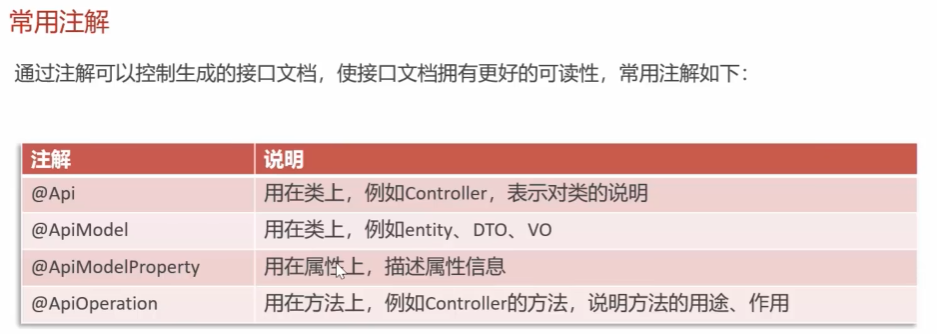

# Swagger、Postman、Apifox、Knife4j 区别总结 — *Swagger, Postman, Apifox, Knife4j: Differences Explained*

## 1. 一句话理解 — *One-Sentence Summary*

| 工具 / Tool | 像什么 / Analogy | 主要作用 / Main Purpose |
|---|---|---|
| Swagger / OpenAPI | API 的"自动说明书" <br> *The "auto-generated instruction manual" for your API* | 根据后端代码生成接口文档 <br> *Generates API docs from your backend code* |
| Postman | API 的"测试枪" <br> *The "test gun" for hitting an API* | 手动发送请求，测试接口 <br> *Manually sends requests to test endpoints* |
| Apifox | API 的"协作工作台" <br> *The "collaborative workbench" for APIs* | 文档 + 测试 + Mock + 团队协作 <br> *Docs + testing + mocks + team collaboration* |
| Knife4j | Swagger 的"精装修中文版" <br> *The "deluxe Chinese edition" of Swagger* | 美化和增强 Swagger 文档页面 <br> *Beautifies and enhances Swagger doc pages* |

---

## 2. Swagger / OpenAPI 是什么？ — *What Is Swagger / OpenAPI?*

Swagger 是用来生成和展示 API 文档的工具体系。

*Swagger is a toolchain for generating and displaying API documentation.*

现在更标准的名字叫 **OpenAPI**，但很多开发者还是习惯叫 Swagger。

*The modern, more standardized name is **OpenAPI**, but many developers still call it Swagger out of habit.*

在 Spring Boot 项目里，你写了这样的 API：

*In a Spring Boot project, suppose you write an API like this:*

```java
@GetMapping("/patients/{id}")
public Patient getPatient(@PathVariable Long id) {
    return patientService.getPatient(id);
}
````

Swagger / OpenAPI 可以自动识别：

*Swagger / OpenAPI can automatically detect:*

```text
GET /patients/{id}
参数：id
返回值：Patient
```

然后生成一个网页，让前端、测试、后端都能看懂这个接口怎么用。

*It then generates a web page so that frontend, QA, and backend can all understand how to use the endpoint.*

常见 Swagger UI 地址：

*Common Swagger UI address:*

```text
http://localhost:8080/swagger-ui/index.html
```
---
### swagger的注释： — *Swagger Annotations:*



## 3. Postman 是什么？ — *What Is Postman?*

Postman 是 API 测试工具。

*Postman is an API testing tool.*

你需要自己手动创建请求：

*You need to manually create requests yourself:*

```text
GET http://localhost:8080/patients/1
```

然后点击 **Send**，查看后端返回结果。

*Then click **Send** and inspect the response from the backend.*

Postman 默认不会自动扫描你的 Spring Boot 代码。

*By default, Postman does not automatically scan your Spring Boot code.*

但是，Postman 可以导入 Swagger / OpenAPI 文档，然后自动生成一组 API 请求。

*However, Postman can import a Swagger / OpenAPI document and auto-generate a collection of API requests from it.*

所以关系是：

*So the relationship looks like this:*

```text
Spring Boot 代码
      ↓
Swagger 自动生成 OpenAPI 文档
      ↓
Postman 导入文档
      ↓
Postman 生成请求集合
```

---

## 4. Apifox 是什么？ — *What Is Apifox?*

Apifox 更像是：

*Apifox is more like:*

```text
Postman + Swagger + Mock + 团队协作
```

它可以做：

*It can handle:*

```text
API 文档
API 测试
Mock 数据
自动化测试
团队协作
```

国内团队比较常用 Apifox。

*Apifox is widely used by teams in China.*

但它通常不是直接"贴着后端代码自动生成"，而是更偏向团队一起维护 API 文档和测试流程。

*But it usually doesn't auto-generate docs directly from backend code; it leans more toward teams collaboratively maintaining API docs and test workflows.*

---

## 5. Knife4j 是什么？ — *What Is Knife4j?*

Knife4j 是 Swagger / OpenAPI 的增强版 UI。

*Knife4j is an enhanced UI on top of Swagger / OpenAPI.*

它常用于 Java Spring Boot 项目。

*It is commonly used in Java Spring Boot projects.*

可以这样理解：

*You can think of it this way:*

```text
Swagger / OpenAPI 负责生成接口数据
Knife4j 负责把接口文档页面做得更好看、更好用
```

Knife4j 本身不是主要负责"发现 API"的。

*Knife4j itself is not primarily responsible for "discovering" APIs.*

真正识别这些注解的是 Swagger / OpenAPI 相关库：

*The libraries that actually recognize the annotations below are the Swagger / OpenAPI ones:*

```java
@GetMapping
@PostMapping
@RequestBody
@PathVariable
@RequestParam
```

Knife4j 主要负责展示和增强体验。

*Knife4j is mainly responsible for presentation and enhanced user experience.*

---

## 6. Knife4j 的访问地址 — *Knife4j Access URL*

Knife4j 生成的接口文档"主页"网址通常是：

*The "home page" URL of Knife4j-generated docs is usually:*

```text
http://localhost:8080/doc.html
```

拆开看：

*Breaking it down:*

```text
http://        协议
localhost     代表你自己的电脑
8080          Spring Boot 后端服务端口号
doc.html      Knife4j 默认入口页面
```

也就是说：

*In other words:*

| 部分 / Part | 含义 / Meaning |
| ----------- | --------------------- |
| `localhost` | 你自己的电脑 <br> *Your own machine* |
| `8080`      | Spring Boot 后端服务运行的端口 <br> *The port where your Spring Boot backend runs* |
| `doc.html`  | Knife4j 框架约定的默认入口文件名 <br> *Knife4j's conventional default entry file* |

如果你的 Spring Boot 配置里端口改成了：

*If you change the port in your Spring Boot config to:*

```yaml
server:
  port: 9090
```

那么 Knife4j 地址就会变成：

*Then the Knife4j URL becomes:*

```text
http://localhost:9090/doc.html
```

---

## 7. 它们的核心区别 — *Their Core Differences*

| 对比点 / Dimension | Swagger / OpenAPI | Postman | Apifox | Knife4j |
| ---------------- | ----------------- | ------- | -------------- | -------------------- |
| 主要用途 <br> *Main purpose* | 自动生成 API 文档 <br> *Auto-generates API docs* | 测试 API <br> *Tests APIs* | 文档 + 测试 + Mock <br> *Docs + tests + mocks* | 增强 Swagger 文档页面 <br> *Enhances Swagger doc pages* |
| 是否能自动识别后端 API <br> *Can auto-detect backend APIs?* | 可以 <br> *Yes* | 默认不行 <br> *Not by default* | 通常需要导入或维护 <br> *Usually requires import or manual upkeep* | 依赖 Swagger / OpenAPI <br> *Depends on Swagger / OpenAPI* |
| 是否能测试接口 <br> *Can test endpoints?* | 可以 <br> *Yes* | 可以 <br> *Yes* | 可以 <br> *Yes* | 可以 <br> *Yes* |
| 是否适合 Spring Boot <br> *Suitable for Spring Boot?* | 很适合 <br> *Very* | 很适合 <br> *Very* | 也适合 <br> *Also suitable* | 很适合 <br> *Very* |
| 是否适合团队协作 <br> *Suitable for team collaboration?* | 一般 <br> *Average* | 可以 <br> *Yes* | 很适合 <br> *Very* | 一般 <br> *Average* |
| 本质 <br> *Nature* | API 标准 / 文档生成 <br> *API spec / doc generator* | API 客户端 <br> *API client* | API 管理平台 <br> *API management platform* | Swagger 增强 UI <br> *Enhanced UI for Swagger* |

---

## 8. 为什么有 Postman / Apifox 还需要 Swagger？ — *Why Do We Still Need Swagger When We Have Postman / Apifox?*

因为 Swagger 和 Postman 站的位置不同。

*Because Swagger and Postman stand in different positions.*

```text
Swagger 站在后端代码旁边，自动看你写了哪些接口。

Postman 站在客户端角度，帮你发送请求测试接口。
```

比如你改了后端接口：

*For example, suppose you change a backend endpoint:*

```text
/patients/{id}
```

改成：

*to:*

```text
/api/v1/patients/{id}
```

Swagger 通常会随着后端代码自动更新。

*Swagger usually updates automatically with the backend code.*

但 Postman 里的请求如果没人改，就可能还是旧地址。

*But requests stored in Postman may still point at the old URL unless someone updates them.*

所以：

*So:*

```text
Swagger 解决"接口文档会不会过期"的问题。

Postman 解决"接口能不能请求成功"的问题。
```

---

## 9. 实际开发中的常见流程 — *Typical Workflow in Real-World Development*

```text
后端写 Spring Boot API
        ↓
Swagger / OpenAPI 自动扫描接口
        ↓
生成 OpenAPI 文档数据
        ↓
Swagger UI 或 Knife4j 展示接口页面
        ↓
前端 / 测试 / 后端查看接口说明
        ↓
Postman / Apifox 发送请求进行测试
```

---

## 10. 最形象的比喻 — *The Most Vivid Analogy*

```text
Swagger = 自动生成的 API 说明书

Postman = 拿着接口地址去敲门的测试工具

Apifox = 说明书 + 测试工具 + Mock 工厂 + 团队协作空间

Knife4j = Swagger 说明书的精装修中文版
```

---

## 11. 最重要的一句话 — *The Single Most Important Takeaway*

```text
Swagger 负责"让别人知道你的 API 长什么样"。

Postman 负责"帮你实际请求这个 API"。

Apifox 负责"把 API 文档、测试、Mock、协作放在一起"。

Knife4j 负责"让 Swagger 页面更好看、更好用"。
```

---

## 12. 对 Spring Boot 项目的推荐理解 — *Recommended Mental Model for Spring Boot Projects*

如果你在做 Spring Boot 后端项目，常见组合是：

*If you are building a Spring Boot backend project, the common combo is:*

```text
Swagger / OpenAPI + Knife4j
```

用来自动生成并展示 API 文档。

*— used to auto-generate and display the API documentation.*

然后再用：

*Then also use:*

```text
Postman 或 Apifox
```

来测试接口请求是否真的能跑通。

*— to test whether the endpoints actually work end-to-end.*

所以它们不是谁替代谁，而是分工不同：

*So they don't replace each other; they have different responsibilities:*

```text
Swagger / Knife4j：文档生成与展示
Postman：接口请求测试
Apifox：一站式 API 管理
```

```
```
