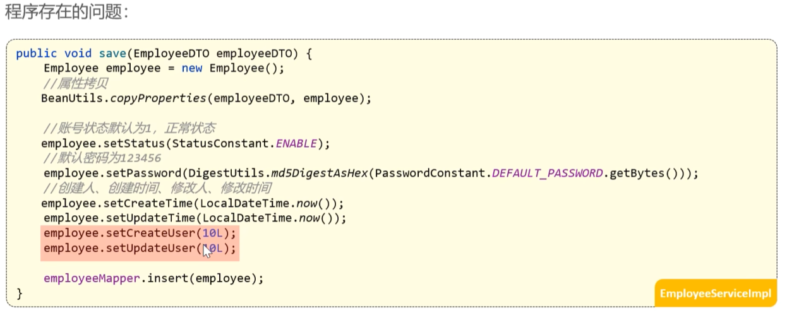
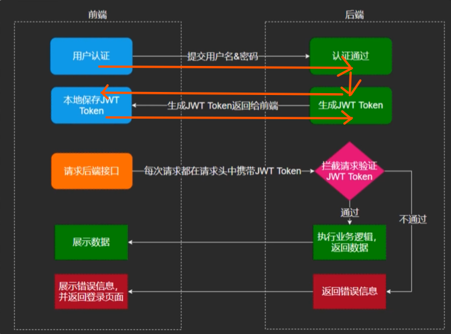
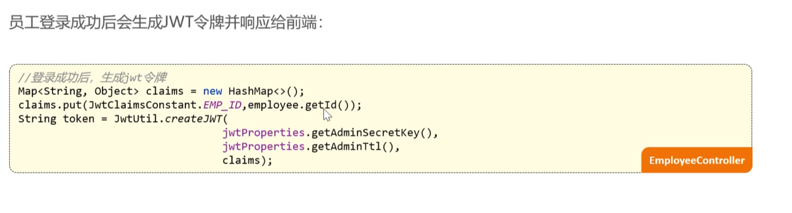
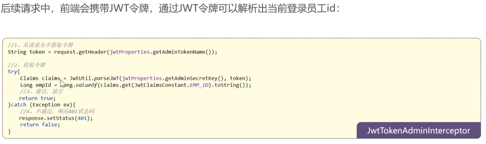

2 




## 逻辑 — *The Logic*



### 解析出登录员工的id后，如何传递给service的save方法？ — *Once We've Parsed the Logged-in Employee's ID, How Do We Pass It to the Service's `save()` Method?*

### ThreadLocal** 是解决“谁在操作数据库”这个问题的核心武器 — ***ThreadLocal** Is the Core Weapon for Answering "Who Is Operating the Database?"*

你可以把 **ThreadLocal** 理解为每个线程（Request 请求）专属的一个“私人保险柜”。

*You can think of **ThreadLocal** as a "private safe deposit box" that belongs exclusively to each thread (i.e., each incoming HTTP request).*

---

### 1. 核心定义 — *Core Definition*

**ThreadLocal** 并不是一个线程，而是线程的一个**局部变量**。

***ThreadLocal** is not a thread itself — it is a **thread-local variable** owned by each thread.*

* **线程隔离**：它为每个执行任务的线程提供了一份独立的存储空间。
* **只有你能看**：存在这个保险柜里的东西，只有当前的这个线程能看到和修改，其他线程（即使同时在运行）完全看不见。

***Key points:***

* ***Thread isolation:** It gives every executing thread an independent slot of storage.*
* ***Only you can see it:** Whatever you put in this safe box can only be read or modified by the current thread — other threads (even when running concurrently) cannot see it at all.*

---

### 2. 生动的比喻：健身房的私人储物柜 — *A Vivid Analogy: Private Lockers at the Gym*

想象一个健身房（我们的后端程序）：

*Imagine a gym (our backend application):*

* **线程（Thread）**：就是进入健身房锻炼的**顾客**。
* **代码逻辑**：就是健身房里的**运动器材**。所有顾客都用同样的器材（执行同样的代码）。
* **ThreadLocal**：就是健身房里的**私人储物柜**。

***Mapping:***

* ***Thread:** the **customer** walking into the gym to work out.*
* ***Code logic:** the **gym equipment** — every customer uses the same equipment (executes the same code).*
* ***ThreadLocal:** the **personal locker** assigned to each customer.*

**工作流程：**

1. 顾客 A 进门（请求开始），把自己的手机（用户 ID）存进自己的 1 号柜。
2. 顾客 B 进门，把自己的手机（另一个用户 ID）存进自己的 2 号柜。
3. 当他们在跑步机上锻炼（执行 Service 层代码）时，如果想看时间，只需去**自己的柜子**里拿手机。
4. **重点**：顾客 A 绝对拿不到顾客 B 的手机，他们互不干扰。

***Workflow:***

1. *Customer A walks in (a request begins) and places their phone (user ID) in locker #1.*
2. *Customer B walks in and places their phone (a different user ID) in locker #2.*
3. *While they exercise on the treadmill (executing Service-layer code), if they need to check the time, they simply retrieve the phone from **their own locker**.*
4. ***Key point:** Customer A absolutely cannot grab Customer B's phone — they don't interfere with each other at all.*

---

### 3. 为什么在项目中非要用它？（解决“参数地狱”） — *Why Do We Insist on Using It in the Project? (To Solve "Parameter Hell")*

在[新增员工](https://www.google.com/search?q=https://www.bilibili.com/video/BV1TP411v7v6%3Fp%3D20)的功能里，我们需要在 `Service` 层知道当前登录人的 ID，以便填入 `createUser` 字段。

*In the [Add Employee](https://www.google.com/search?q=https://www.bilibili.com/video/BV1TP411v7v6%3Fp%3D20) feature, the `Service` layer needs to know the ID of the currently logged-in user in order to populate the `createUser` field.*

* **笨办法（不推荐）**：在每个方法（Controller -> Service -> Mapper）的参数里都传一个 `Long empId`。
* *代价*：如果项目有 100 个方法要用这个 ID，你得改 100 遍代码，非常痛苦。

***Dumb approach (not recommended):** pass a `Long empId` as a parameter through every method (Controller → Service → Mapper).*
* ***Cost:** if 100 methods in your project need this ID, you must modify 100 method signatures — extremely painful.*


* **聪明办法（ThreadLocal）**：
1. 在 **拦截器 (Interceptor)** 校验 JWT 令牌通过后，直接把解析出来的 `empId` 存入当前线程的 `ThreadLocal`。
2. 后续无论在哪个类、哪个方法里，只要还在同一个线程内，随时随地用 `BaseContext.getCurrentId()` 就能取出来。

***Smart approach (ThreadLocal):***

1. *Once the **Interceptor** validates the JWT, store the parsed `empId` directly into the current thread's `ThreadLocal`.*
2. *Afterwards, in any class or method — as long as we're still on the same thread — we can pull it out anytime via `BaseContext.getCurrentId()`.*


---

### 4. 在代码里怎么用？ — *How Do We Use It in Code?*

在你的项目中，黑马程序员提供了一个工具类叫做 `BaseContext`：

*In this project, the Heima curriculum provides a utility class called `BaseContext`:*

```java
public class BaseContext {
    // 创建一个 ThreadLocal 容器
    public static ThreadLocal<Long> threadLocal = new ThreadLocal<>();

    // 存数据（一般在拦截器里干）
    public static void setCurrentId(Long id) {
        threadLocal.set(id);
    }

    // 取数据（在 Service 补全 Entity 时干）
    public static Long getCurrentId() {
        return threadLocal.get();
    }

    // 删数据（防止内存泄漏）
    public static void removeCurrentId() {
        threadLocal.remove();
    }
}

```

---

### 📝 深度总结 — *In-Depth Summary*

* **生命周期**：在一次 HTTP 请求中，Spring Boot 会分配一个线程来处理。这个线程从接收请求到返回响应，这一路上的所有代码操作，共享同一个 `ThreadLocal` 空间。
* **安全性**：它保证了用户 A 的信息绝不会被错扣在用户 B 的头上。

***Key points:***

* ***Lifecycle:** For each HTTP request, Spring Boot assigns a single thread to process it. Every piece of code executed on that thread — from receiving the request to sending the response — shares the same `ThreadLocal` storage.*
* ***Safety:** It guarantees that user A's information will never accidentally be applied to user B.*

你现在是不是正准备把拦截器里解析出来的 `empId` 通过 `BaseContext` 存起来？在这一步有没有遇到 `id` 拿出来是 `null` 的情况？

*Are you about to store the `empId` parsed from the interceptor via `BaseContext`? Have you run into the case where the retrieved `id` turns out to be `null`?*

# 具体代码修改的部分是： — *The Specific Code Changes Are:*
```java
public void save(EmployeeDTO employeeDTO) {
Employee employee = new Employee();
//对象属性拷贝
//                          源头    --     拷贝对象
BeanUtils.copyProperties(employeeDTO,employee);
// employee 里的属性比employeeDTO还有更多。所以需要设置

        employee.setStatus(StatusConstant.ENABLE);
        //设置账号的状态，默认正常状态 1表示正常 0为锁定

        employee.setPassword(DigestUtils.md5DigestAsHex(PasswordConstant.DEFAULT_PASSWORD.getBytes()));
        //设置密码，默认123456

        //设置当前记录的创建时间和修改时间
        employee.setCreateTime(LocalDateTime.now());
        employee.setUpdateTime(LocalDateTime.now());

        //设置当前记录创建人的id
        //TODO 后期改为当前登录用户的id 因为现在不知道登陆人的id
        employee.setCreateUser(BaseContext.getCurrentId());
        employee.setUpdateUser(BaseContext.getCurrentId());

        employeeMapper.insert(employee);
    }

}

```
```java
public boolean preHandle(HttpServletRequest request, HttpServletResponse response, Object handler) throws Exception {
    //判断当前拦截到的是Controller的方法还是其他资源
    if (!(handler instanceof HandlerMethod)) {
        //当前拦截到的不是动态方法，直接放行
        return true;
    }

    //1、从请求头中获取令牌
    String token = request.getHeader(jwtProperties.getAdminTokenName());

    //2、校验令牌
    try {
        log.info("jwt校验:{}", token);
        Claims claims = JwtUtil.parseJWT(jwtProperties.getAdminSecretKey(), token);
        Long empId = Long.valueOf(claims.get(JwtClaimsConstant.EMP_ID).toString());
        log.info("当前员工id：", empId);
        BaseContext.setCurrentId(empId);
        //使用thread local
        //3、通过，放行
        return true;
    } catch (Exception ex) {
        //4、不通过，响应401状态码
        response.setStatus(401);
        return false;
    }
}
```
