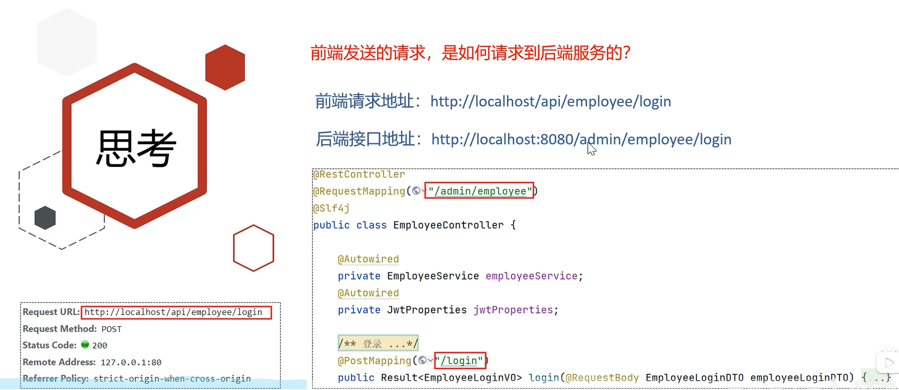
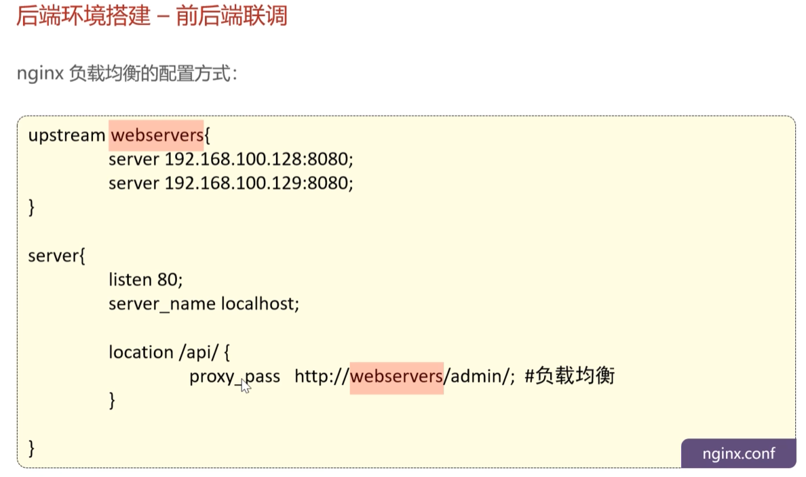
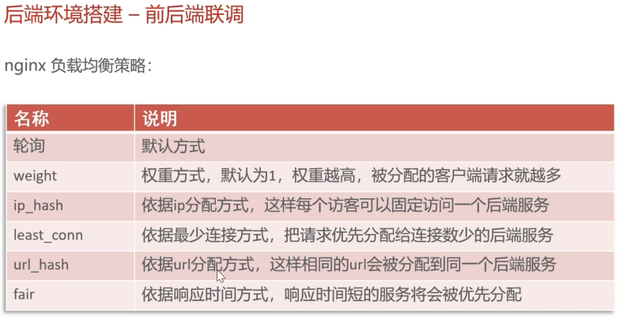
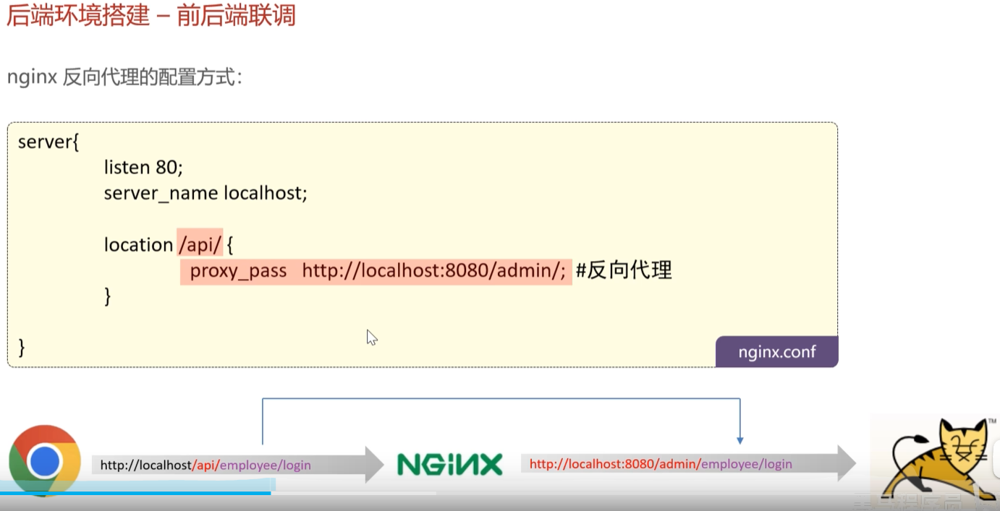

在《苍穹外卖》这个项目里，Nginx（简称 NG）就像是餐厅里的“超级领班”。如果没有它，后端的 Spring Boot（大厨）可能会直接被食客（前端请求）淹没。

为了让你更生动地理解，我们把 Nginx 的好处拆解成四个形象的角色：

---

### 1. 它是“金牌翻译官”（反向代理）

**场景：** 这里的食客（前端）说的是“/api/”语，而大厨（后端）只听得懂“/admin/”语。

* **形象理解**：如果没有 Nginx，前端直接找后端，由于语言不通（路径不匹配）和安保限制（跨域问题），大厨根本不理你。
* **具体好处**：Nginx 站在门口，把前端的 `http://localhost/api/login` 翻译成后端能懂的 `http://localhost:8080/admin/login`。
* **核心价值**：**解决跨域**，让前后端虽然住在不同的“房间”（端口），但能顺畅交流。

### 2. 它是“排队调度员”--可以分发好几个服务器server（负载均衡）

**场景：** 餐厅生意太火爆，一个大厨（服务器）炒菜冒烟了都忙不过来。

* **形象理解**：你开了三家分店（后端集群：服务器A、B、C）。Nginx 站在街口看哪家店人少，就带客人去哪家。
* **具体好处**：他在 [nginx.conf](https://www.google.com/search?q=https://www.bilibili.com/video/BV1TP411v7v6%3Fp%3D10) 里配置 `upstream`。当几千个请求涌入时，他平均分配，不让任何一个大厨累趴下。
* **核心价值**：**高并发处理**，让系统像丝般顺滑，不会因为人多就挂掉。
* **负载均衡策略**：<BR>

### 3. 它是“硬核保镖”（安全隔离）

**场景：** 坏人想直接冲进厨房看大厨用什么调料、偷看保险柜。

* **形象理解**：大厨躲在隐蔽的后院（内网），外人根本看不见。所有人只能看到大门口的 Nginx。
* **具体好处**：Nginx 暴露在公网，而后端服务器藏在防火墙后面。即使黑客攻击，也只能攻击到 Nginx 这个“前台”，碰不到核心数据和代码。
* **核心价值**：**保护后端安全**，隐藏真实服务器 IP。

### 4. 它是“闪电外送员”（动静分离）

**场景：** 有人只想买瓶矿泉水（静态图片/HTML），大厨还要停下手里的炒锅去拿，太浪费时间。

* **形象理解**：Nginx 柜台里直接摆好了矿泉水（静态资源）。
* **具体好处**：对于图片、CSS、JS 等不需要大厨（Java代码）加工的东西，Nginx 自己直接秒发给用户，根本不经过后端。
* **核心价值**：**极速响应**，解放后端资源，让大厨专心处理复杂的炒菜逻辑（业务逻辑）。

---

### 📝 总结笔记：Nginx 的四大神功

| 角色 | 术语 | 一句话概括 |
| --- | --- | --- |
| **翻译官** | **反向代理** | 统一入口，转化路径，解决跨域。 |
| **调度员** | **负载均衡** | 多个后端排排坐，请求分发不塞车。 |
| **保镖** | **安全屏蔽** | 后端藏得深，黑客找不着。 |
| **外送员** | **动静分离** | 静态网页跑得快，后端减负不等待。 |

---

**学习建议：**
你在看 [Day01-10 视频](https://www.google.com/search?q=https://www.bilibili.com/video/BV1TP411v7v6%3Fp%3D10) 配置 `proxy_pass` 的时候，可以试着故意把 Nginx 关掉，你会发现前端页面能打开（静态资源还在），但登录按钮点了一点反应都没有（动态转发断了）。这能帮你更深刻地理解 Nginx 的“翻译”作用。

你现在能分清，为什么图片加载很快，而登录有时需要转圈圈了吗？（一个是 Nginx 直接给的，一个是 Nginx 转交给后端算的）

# 在《苍穹外卖》项目里，Nginx 就像是一个“精明的超级前台”。它不仅负责接待（接收请求），还会根据你的需求帮你“转接”到正确的部门，甚至顺手帮你改个名字。

以下是关于 Nginx 动态请求转化的生动解析：

---

### 1. Nginx 是如何“变魔术”转化 HTTP 的？

当你在浏览器（前端）点击登录，请求会先到 Nginx，然后发生了一场悄无声息的“身份伪装”： -- 这个需要`nginx.conf`里配置

* **路径整容**：Nginx 发现你带着 `/api/` 的工牌，它会按照你的配置，把 `/api/` 撕掉，换成后端真正认识的 `/admin/`。
* **全量搬运**：除了把 URL 路径改了，Nginx 会把 HTTP 的“灵魂”——也就是 **Method**（POST）、**Body**（用户名密码）和 **Header**（JWT 令牌）完整打包，发给后端 8080 端口。
* **最终结果**：浏览器发的 `http://localhost/api/employee/login` $\rightarrow$ 变成了发给后端的 `http://localhost:8080/admin/employee/login`。

---

### 2. 如何配置 `nginx.conf`？

在 [Day01-10 视频](https://www.google.com/search?q=https://www.bilibili.com/video/BV1TP411v7v6%3Fp%3D11) 中，核心配置就在 `server` 块里。你可以把它看作一套“分流规则”：

```nginx
server {
    listen       80;          # Nginx 监听的窗口（前端访问的端口）
    server_name  localhost;   # 监听的名字

    # 规则1：如果是普通的请求，直接去拿静态网页
    location / {
        root   html/sky;      # 静态资源存放的目录
        index  index.html;
    }

    # 规则2：重点！如果是动态 API 请求，开始转化并转发
    location /api/ {
        # proxy_pass 就是“转发目的地”
        # 结尾的 /admin/ 就是把前面的 /api/ 替换掉的关键！
        proxy_pass   http://localhost:8080/admin/; 
    }
}

```

---

### 3. 只有 `/api/` 开头的会被转化吗？

**是的，但这是你“规定”的。**
Nginx 非常听话，它只会按照你写的 `location` 块来办事：

* 如果请求是 `/api/employee/login`，它匹配到了 `location /api/`，于是触发转发。
* 如果请求是 `/test/hello`，它匹配不到 `/api/`，就会去匹配默认的 `/`，如果静态文件夹里没这个文件，就会报 **404**。

---

### 4. 总结：Login 如何通过 Nginx 加上 Admin？

这个过程在 Nginx 术语里叫 **路径重写 (Path Rewriting)**。你可以这样生动理解：

1. **用户输入**：`/api/login`（这是前端的“外语”）。
2. **Nginx 翻译**：它看到配置里写着 `location /api/` 对应 `proxy_pass .../admin/`。
3. **替换动作**：它像用橡皮擦一样，擦掉 URL 里的 `/api/`，在原位补上 `/admin/`。
4. **递交给后端**：后端 Spring Boot 收到请求时，看到的已经是带有 `/admin/login` 的请求了。

> **小笔记：**
> * **反向代理的好处**：前端不需要知道后端的真实 IP（安全），也不存在跨域报错（省心）。
> * **配置文件生效**：修改完 `nginx.conf` 别忘了运行 `nginx -s reload` 让这位“前台”更新规矩。
>
>

你在 [Day01-10 视频](https://www.google.com/search?q=https://www.bilibili.com/video/BV1TP411v7v6%3Fp%3D11) 里配置完之后，有没有试过在浏览器的“开发者工具（F12）”里，看看请求地址到底是带 `api` 还是带 `admin`？（提示：浏览器显示的永远是带 `api` 的，因为它只跟 Nginx 说话！）


# 为什么叫做“反向”代理（Reverse Proxy）**，是相对于**“正向”代理（Forward Proxy）而言的。

我们可以通过一个生动的例子来理解这个“方向”到底是怎么反过来的。

---

### 1. 正向代理：代理的是“客户端”

**场景**：你想看外网，但你上不去，于是你找了一个**科学上网工具（代理服务器）**。

* **谁发起的**：你（客户端）。
* **代理谁**：代理你。
* **目的是什么**：替你去访问你访问不到的服务器。
* **服务器知道你是谁吗？** 不知道。服务器只知道那个代理服务器来找它了，它不知道背后是你。
* **总结**：**正向代理隐藏了真实的客户端。**

### 2. 反向代理：代理的是“服务端”

**场景**：你访问《苍穹外卖》的网站 `http://localhost`。

* **谁发起的**：你。
* **代理谁**：**Nginx 代理了后台那群“大厨”（Spring Boot 服务器）**。
* **目的是什么**：你以为你直接访问了服务器，其实你访问的是 Nginx。Nginx 收到你的请求后，回头看看哪个大厨有空，把活儿派给他。
* **你知道真实的服务端在哪吗？** 不知道。你只知道 Nginx 的地址，至于背后是一台服务器还是十台服务器，你完全不清楚。
* **总结**：**反向代理隐藏了真实的服务端。**

---

### 3. 生动对比：经纪人 vs 跑腿小哥

* **正向代理（跑腿小哥）**：
  你（客户端）想买奶茶但不想露面，你雇了一个跑腿小哥（代理）去奶茶店。
* 奶茶店（服务端）只看到小哥，不知道是你买的。
* **代理的是你。**


* **反向代理（明星经纪人）**：
  你想找某个大明星（后端服务），你没法直接给明星打电话，你只能打给他的**经纪人（Nginx）**。
* 你（客户端）只跟经纪人说话，经纪人转身把要求告诉明星，再把明星的回复传给你。
* 你甚至不知道明星具体躲在哪个房间里。
* **代理的是明星（服务端）。**


---

### 4. 为什么《苍穹外卖》里一定要叫它“反向代理”？

在 [Day01-10 视频](https://www.google.com/search?q=https://www.bilibili.com/video/BV1TP411v7v6%3Fp%3D11) 中，Nginx 的作用就是典型的经纪人模式：

1. **统一入口**：前端不需要记住 8080 端口（admin）或 8081 端口（user），只需要统一找 Nginx（80 端口）。
2. **安全屏障**：由于你只和 Nginx 说话，你无法直接攻击藏在后面的数据库或 Java 程序。
3. **灵活变通**：就像你问的“如何加上 /admin”，这是经纪人（Nginx）在背地里帮你做的转换，你作为客户根本无感知。

### 📝 深度笔记：方向总结

| 维度 | 正向代理 (Forward) | 反向代理 (Reverse) |
| --- | --- | --- |
| **代理对象** | 客户端 (Client) | 服务端 (Server) |
| **部署位置** | 靠近客户端（或在客户端电脑上） | 靠近服务端（在机房入口） |
| **用户感知** | 用户知道自己用了代理 | 用户以为自己访问的就是最终目标 |
| **典型案例** | 科学上网、公司内网统一出网 | **Nginx**、负载均衡器 |

**一句话总结：**
代理**客户端**出海的叫**正向**；代理**服务端**接客的叫**反向**。

现在你理解了，为什么在 `nginx.conf` 里的配置项叫做 `proxy_pass`（代理转发），因为它就是那个替后端服务器“接活”的经纪人。

你在看视频时，是不是发现 Nginx 不仅能转给一个服务器，还能转给一个 `upstream`（服务器组）？这其实就是利用“反向代理”实现的“负载均衡”，也就是经纪人手下有好几个艺人，谁闲着给谁派活。